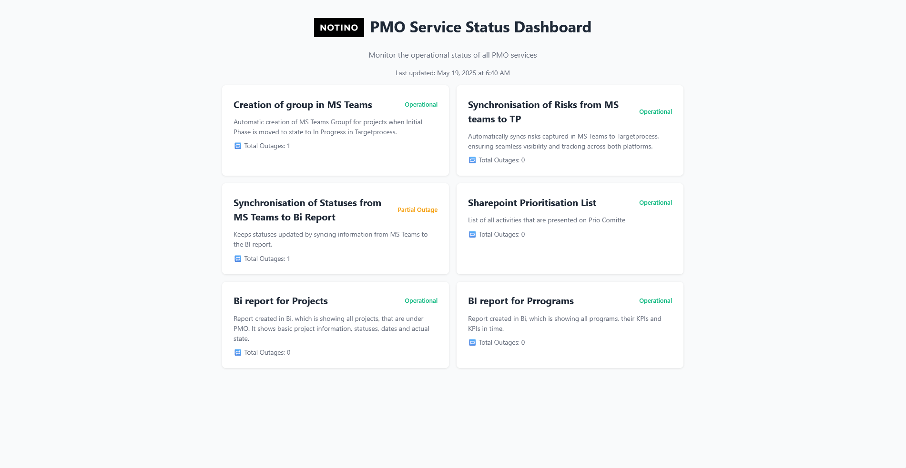

# 🚦 PMO Service Status Dashboard

> Keep your PMO services vibin’ in real-time with a sleek, no-frills status page—powered by a **Google Sheet** backend and a sprinkle of vanilla JS magic.  



---

## ✨ What’s inside?

| Area | Deets |
| ---- | ----- |
| **Frontend** | Pure **HTML + CSS** (Inter font, mobile-first, accessibility-friendly) |
| **Data** | Google Sheets → [OpenSheet](https://opensheet.elk.sh) → JSON (no backend server needed!) |
| **Logic** | `app.js` handles fetch, state, and UI render |
| **UX perks** | Live “Last updated” timestamp, emoji status icons, outage counter, click-to-open modal with incident timeline |

---

## 📂 Project layout
```
.
├── index.html # Main markup
├── styles.css # Tailwind-inspired custom styles
├── app.js # All the JS logic
├── images/
│ ├── notino-logo.png
│ ├── dashboard-preview.png
│ └── icon.png
└── README.md # ← you’re here
```
---

## 🚀 Quick-start

1. **Clone + open**  
   ```bash
   git clone https://github.com/your-org/pmo-status-dashboard.git
   cd pmo-status-dashboard
   open index.html   # or just drag it into your browser
2. **Hook up your Sheet**
Grab the spreadsheet ID from its URL:
```https://docs.google.com/spreadsheets/d/**<THIS-ID>**/edit#gid=0```
Update ```sheetID``` in ```app.js```.

3. **Sheet tabs must be named exactly**
```Services``` — list of services (id, name, status, details…)
```Timeline``` — incident history (serviceId, status, text, time)


## 🛠️ Google Sheet Schema

> Two tabs—`Services` & `Timeline`. Keep the columns exactly as-is so the JS keeps vibin’.  

---

### `Services`

| Column       | Type  | Notes / example                                    |
|--------------|-------|----------------------------------------------------|
| `id`         | str   | Primary key, e.g. `1`                              |
| `name`       | str   | Human-friendly name, e.g. `Jira`                   |
| `status`     | str   | `operational` \| `partial` \| `outage`             |
| `statusText` | str   | Short one-liner, e.g. `All good`                   |
| `details`    | str   | Longer description, Markdown allowed               |

---

### `Timeline`

| Column       | Type  | Notes / example                    |
|--------------|-------|------------------------------------|
| `serviceId`  | str   | FK ↗️ points to `Services.id`       |
| `status`     | str   | Same enum: `operational/partial/outage` |
| `text`       | str   | What went down, e.g. `API 502 errors`  |
| `time`       | date  | ISO/locale-parseable, e.g. `2025-05-01 08:12` |

> Pro tip: Rows can be in any order—`app.js` auto-sorts by newest first. 🙌

## 🌈 Customization tips

| Want to…            | Change                                                             |
| ------------------- | ------------------------------------------------------------------ |
| **Update colors**   | Edit the `:root` variables in **styles.css**.                      |
| **Swap emojis**     | Tweak `getStatusIcon()` in **app.js**.                             |
| **Add uptime bars** | Uncomment the `.uptime` section in **index.html** & extend **JS**. |
| **Deploy static**   | Push to GitHub Pages, Vercel, Netlify—one-click and done.          |


## 🤝 Contributing
Fork ➡️ branch ➡️ PR.
Respect the no-framework vibe—keep dependencies zero.
Small, atomic commits make the maintainers’ hearts happy.

## 📄 License
MIT — do what you want, just keep the credits. ✌️

## 📝 Credits
Built with ❤️ by Tomča & friends. Shout-out to
OpenSheet for the free JSON bridge.

